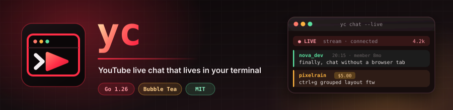
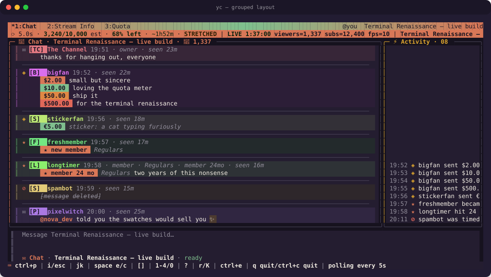
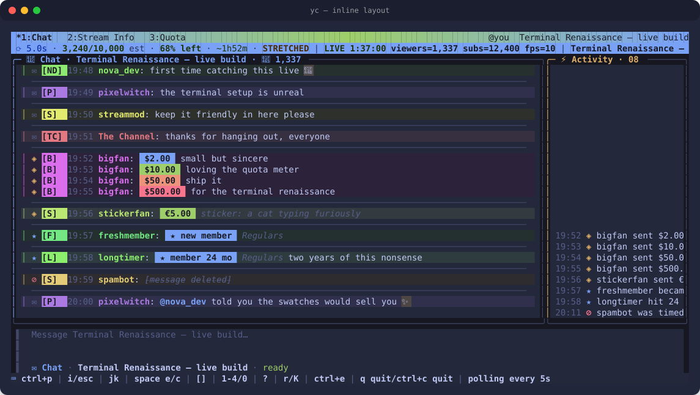
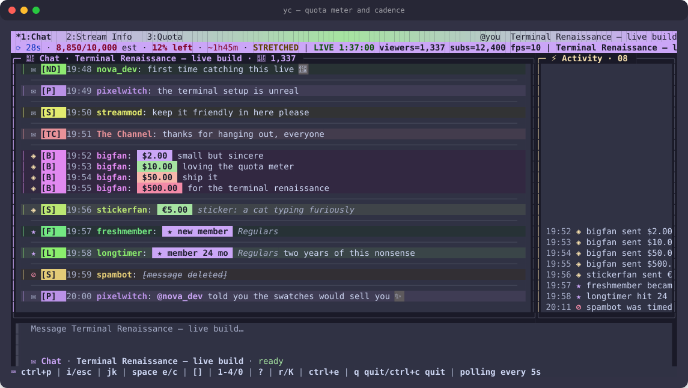
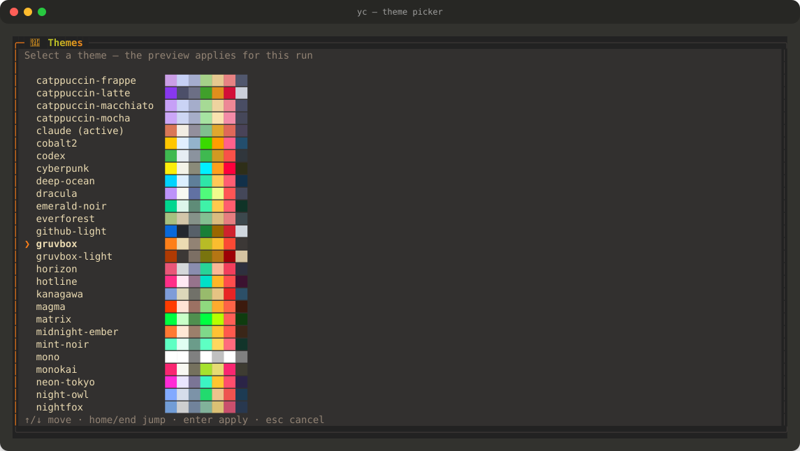

<p align="center">
  
</p>

<p align="center">
  <a href="https://worxbend.github.io/yc/"></a>
  <a href="https://go.dev/"></a>
  <a href="https://developers.google.com/youtube/v3/live/docs"></a>
  <a href="https://github.com/worxbend/yc/actions/workflows/ci.yml"></a>
  <a href="https://github.com/worxbend/yc/releases/latest"></a>
  <a href="Dockerfile"></a>
  <a href="LICENSE"></a>
  <a href="docs/config.md"></a>
</p>

<h1 align="center">yc</h1>

<p align="center">
  <b>YouTube live chat that lives in your terminal.</b><br>
  Keyboard-first · 58 themes · no browser tab · a quota meter you can actually see
</p>

<p align="center">
  <a href="#quickstart">🚀 Quickstart</a> ·
  <a href="#screenshots">📸 Screenshots</a> ·
  <a href="#controls">⌨️ Controls</a> ·
  <a href="#targets">📡 Targets</a> ·
  <a href="#quota">📊 Quota</a> ·
  <a href="#configure-it">⚙️ Config</a> ·
  <a href="https://worxbend.github.io/yc/">🌐 Website</a> ·
  <a href="https://obs.worxbend.com/">🧰 More Tools</a> ·
  <a href="docs/index.md">📚 Docs</a>
</p>

---

```sh
go run ./cmd/yc chat --mock   # 👈 no credentials, no network, no quota, full UI
```

## ✨ Highlights

| | |
| --- | --- |
| 📊 **A quota meter in the status bar** | The YouTube Data API grants 10,000 units a day. Reading chat at the cadence YouTube itself advises exhausts that in under three hours. `yc` meters every call it dispatches, stretches its own poll interval to make the day last, and shows the estimate and the effective cadence on every frame. This is the feature the whole project is shaped around. |
| ⏱️ **Budget-aware poll pacing** | `pollingIntervalMillis` is an absolute floor `yc` never polls beneath. Above it, the interval is whatever makes the remaining units survive until the Pacific reset — with ±10% jitter, backoff, a reserve so sends still work after reads stop, and `--follow-server-cadence` to opt out entirely. |
| 🎨 **58 built-in themes** | 53 dark — including a YouTube-flavored `yc` preset and 24 vibrant near-black palettes authored for this family of tools — and 5 light, plus a custom hex palette. <kbd>ctrl+t</kbd> opens a full-screen picker that previews them live. |
| 🧩 **Three message layouts** | `inline` (dense classic), `grouped` (author header + collapsed run), `compact` (text only). Swap at runtime with <kbd>ctrl+g</kbd> for this run, or set `message_layout` to keep it. |
| 💸 **Every paid and membership event, rendered** | Super Chats, Super Stickers, gifts, new members, milestones, gifting bursts and their recipients, polls, bans, tombstones, members-only mode, and chat ended. An unrecognized `snippet.type` degrades into a readable row instead of a crash. |
| 🌈 **Per-author stable colors** | YouTube publishes no author color, so `yc` derives one from the channel ID. The same person is the same color in every session and on every machine, with no mutable per-user color state anywhere. |
| 💬 **@mention autocomplete** | Completes from the people `yc` has actually seen speak — YouTube reports no presence, so there is no member list to fake. Prefix matches outrank substring matches; <kbd>tab</kbd> accepts. |
| 🔨 **Moderation that never fails silently** | <kbd>d</kbd> delete, <kbd>t</kbd> time out, <kbd>b</kbd> ban — each armed, confirmed, and bounded. Every refusal names a reason you can act on, and removed text is never reprinted on a terminal that may be on stream. |
| 🔑 **Two credential modes, both first class** | An **API key** reads any public live chat with no OAuth at all. `yc login` runs a Google installed-app flow (loopback + PKCE) for sending and moderation. Missing capabilities disable controls *with a reason* instead of hiding them. |
| 🧪 **Mock mode** | The whole UI with zero credentials, zero network, and zero quota — ideal for trying it or filing a bug. A non-TTY renders one ANSI-stripped frame and exits 0, which is also the CI smoke. |
| 🩺 **Honest diagnostics** | `yc doctor` runs 15 checks and reports what it verified *and* what it could not. `yc quota` prints today's ledger without spending a unit. |
| 🔐 **Secrets stay redacted** | Access tokens, refresh tokens, client secrets, API keys, OAuth codes, state, PKCE verifiers, and authorization URLs are kept out of output, logs, errors, and diagnostics by design. |

<a id="screenshots"></a>

## 📸 Screenshots

> Every image is generated by rendering `yc`'s real `View()` output and converting
> the terminal frame to SVG, so it cannot drift from what the app actually prints.
> A test asserts each frame is perfectly rectangular, so a ragged pane fails CI
> rather than waiting to be noticed. Regenerate with
> `YC_WRITE_SCREENSHOTS=1 go test ./internal/app -run TestWriteDocsScreenshots`.

<p align="center">
  
</p>

<details>
<summary>📜 <b>Inline layout</b> — the dense classic view (theme: <code>tokyo-night</code>)</summary>
<p align="center"></p>
</details>

<details>
<summary>📊 <b>Quota meter</b> — the day mostly spent, cadence stretched to 27.5s (theme: <code>catppuccin-mocha</code>)</summary>
<p align="center"></p>
</details>

<details>
<summary>🎨 <b>Theme picker</b> — every preset with its own swatch strip, previewed live</summary>
<p align="center"></p>
</details>

## 🤔 Why It Exists

[`twi`](https://github.com/worxbend/twi) put Twitch chat in the terminal. YouTube
is the same idea against a very different API, and the difference is the entire
design.

Twitch gives you an IRC socket: you connect once and messages arrive. YouTube
gives you `liveChatMessages.list` and a daily unit allowance. There is no chat
socket a plain REST client can reach — `liveChatMessages.streamList` is
documented but absent from the discovery document — so a YouTube chat client is a
*polling* client, and a polling client on a metered API is a *budgeting* client.
Every interesting decision in `yc` falls out of that:

- 🖥️ A real TUI shell with mock mode, multi-chat state, a command palette,
  selected-message inspect, reply context, local filters, moderation
  confirmations, and resize-aware layouts that degrade cleanly into a small
  terminal.
- 📊 A quota ledger persisted per credential per Pacific day, charged on every
  dispatched call *including failures*, and surfaced in the status bar, a whole
  tab, `yc doctor`, and `yc quota`.
- ⏱️ A poll scheduler that treats `pollingIntervalMillis` as inviolable, layers a
  budget floor above it, jitters, backs off on `rateLimitExceeded`, refuses to
  retry an exhausted quota, and keeps a reserve so sending still works when
  reading has stopped.
- 🔤 Text-first rendering for avatars, badges, and emoji — `[XY]` initials chips,
  stable per-author colors, glyph or text badges, native Unicode emoji. There is
  no image path, because the API supplies no badge imagery and no per-message
  emote metadata to render one from.
- 🛡️ A security posture that keeps tokens, refresh tokens, client secrets, API
  keys, OAuth codes/state/verifiers, and authorization URLs out of normal output
  and debug logs.

> [!IMPORTANT]
> **No credentialed path in this repository has ever been run against Google.**
> Mock chat, diagnostics, config, theming, rendering, and the quota arithmetic are
> exercised by tests and by credential-free smokes. Every credentialed path —
> `yc login`, live polling, sending, moderation, the identity lookup, stream
> info — is written and unit-tested against fakes and `httptest`, and has never
> touched a real account. See [docs/manual-validation.md](docs/manual-validation.md).

<a id="quickstart"></a>

## 🚀 Quickstart

Run the no-risk mock mode — no credentials, no network, no quota:

```sh
go run ./cmd/yc chat --mock
```

Build and run the binary:

```sh
go build -o bin/yc ./cmd/yc
./bin/yc chat --mock
```

Install a published release on Linux. The script picks `amd64` or `arm64`,
refuses any other platform by name, and verifies the SHA-256 checksum before
anything is installed. It never edits your shell profile — if `~/.local/bin` is
not on `PATH` it prints the line to add and leaves the decision to you. It needs
`bash`; on Debian and Ubuntu `/bin/sh` is `dash`, so pipe into `bash` explicitly:

```sh
curl --proto '=https' --tlsv1.2 -sSf \
  https://github.com/worxbend/yc/releases/latest/download/install.sh | bash
```

Pin a version or choose a directory:

```sh
curl --proto '=https' --tlsv1.2 -sSf \
  https://github.com/worxbend/yc/releases/latest/download/install.sh \
  | bash -s -- --version v0.1.0 --bin-dir "$HOME/bin"
```

Or download the artifact by hand and check it yourself:

```sh
base=https://github.com/worxbend/yc/releases/latest/download
curl -fsSLO "$base/yc_linux_amd64"
curl -fsSLO "$base/yc_linux_amd64.sha256"
sha256sum -c yc_linux_amd64.sha256
install -m 0755 yc_linux_amd64 "$HOME/.local/bin/yc"
```

**Only `linux/amd64` and `linux/arm64` binaries are published.** There is no
macOS build, no Windows build, no snap, no package-manager manifest, no
signing, and no notarization. On any other platform, build from source.

With a Go toolchain:

```sh
go install github.com/worxbend/yc/cmd/yc@latest
```

Use Docker:

```sh
docker build -t yc:local .
docker run --rm -it yc:local chat --mock
```

Check your setup:

```sh
yc doctor
yc quota     # today's ledger; spends nothing
```

## 📺 Live YouTube Chat

> **Bring your own Google Cloud project.** `yc` ships with no built-in
> application and no API key. For any live path you create a project, enable
> **YouTube Data API v3**, and give `yc` either an API key (read-only) or an
> OAuth **Desktop app** client ID. See
> [docs/register-google-app.md](docs/register-google-app.md) for the walkthrough.

There are two credential modes and they are genuinely different products:

| Mode | Needs | Can do | Cannot do |
| --- | --- | --- | --- |
| **API key** | one API key | read any *public* live chat | send, moderate, resolve your own identity, read your subscriptions |
| **OAuth** | a Desktop-app client ID (+ `yc login`) | read, send, and — with `youtube.force-ssl` — delete, time out, and ban | nothing `yc` implements today, subject to granted scopes |

Read-only mode is the zero-friction path:

```sh
export YC_YOUTUBE_API_KEY="<api key from Google Cloud>"
yc chat --video dQw4w9WgXcQ
```

The full path runs the installed-app OAuth flow:

```sh
export YC_GOOGLE_CLIENT_ID="<desktop-app client id>"
yc login
yc chat --channel @somechannel
```

`yc chat` refuses before opening a socket when nothing is configured, exits `2`,
and names all three ways forward (`yc login`, `YC_YOUTUBE_API_KEY`, `--mock`).

Credentials come from CLI flags, environment variables, the flat config file, or
the private credential file written by `yc login` — in that order, highest
first. Saved credentials are Unix-only; non-Unix builds keep them disabled and
use environment variables or a private config file. A saved token shadowed by an
environment or config token is reported as shadowed rather than silently ignored.

### 🔑 OAuth Login Command

`yc login` runs Google's installed-app authorization-code flow: a loopback
listener on `127.0.0.1` with an ephemeral port, PKCE S256, and
`access_type=offline`. It requests:

| Scope | Enables |
| --- | --- |
| `https://www.googleapis.com/auth/youtube.readonly` | read live chat, broadcast metadata, your own channel, your subscriptions |
| `https://www.googleapis.com/auth/youtube.force-ssl` | send chat messages, delete messages, manage live chat bans |

```sh
export YC_GOOGLE_CLIENT_ID="<desktop-app client id>"
yc login
yc login --read-only     # readonly scope only
yc login --dry-run       # explains everything, contacts nothing
yc logout                # deletes saved credentials and revokes remotely
```

A **client secret is optional**. An installed app cannot keep a secret, so the
desktop flow authenticates with PKCE alone; set `YC_GOOGLE_CLIENT_SECRET` only if
your OAuth client was issued one and refresh would otherwise be rejected.

`yc login --write-default-config` writes a starter `config.toml` (non-secret keys
only) at the effective config path first, but only when no file exists there yet.

The command never prints or logs the access token, refresh token, authorization
code, OAuth state, PKCE verifier, authorization URL, client secret, or API key.

Do not paste real credentials into commits, screenshots, issue comments, terminal
recordings, or public support threads. `yc config show`, `yc doctor`, and opt-in
debug logs redact secrets by design, but review debug files before sharing them —
they can still contain video IDs, chat IDs, channel names, and hostnames.

<a id="what-works-today"></a>

## ✅ What Works Today

Statuses mean: **Ready** — exercised by automated tests and credential-free
smokes. **Partial** — shipped for a narrower behavior than the name suggests.
**Credentialed** — implemented and unit-tested against fakes or `httptest`, and
**never run against Google**. **Manual** — needs a human at a terminal.
**Planned** — not built. **Out of scope** — deliberately absent.

| Area | Status | Current behavior |
| --- | --- | --- |
| Mock chat | Ready | `yc chat --mock` runs the whole UI with no credentials, no network, and no quota, playing a scripted stream with Super Chats, memberships, a gifting burst, a poll, moderation, and a chat ending. A non-TTY renders one ANSI-stripped frame and exits 0. |
| Config commands | Ready | `yc config show` prints all 49 effective flat-config keys with secrets replaced by `[redacted]`; `yc config path` prints the default path. |
| Diagnostics | Ready | `yc doctor` runs 15 checks — credential file, credentials, quota budget arithmetic, debug-log hardening, config load, credential mode, theme, display modes, cache writability, debug log, configured chats, the cost table in force, today's ledger, API reachability, and identity. Everything but the last two is fully offline. |
| Quota accounting | Ready | A mutex-guarded ledger charges every dispatched call including failures, keyed by credential fingerprint and Pacific day, persisted under the cache directory, DST-correct across the midnight reset. `search.list` spends its own 100-call bucket. `yc quota` prints it and spends nothing; old records are pruned on chat startup. |
| Quota-aware pacing | Ready | `NextInterval` clamps `max(serverFloor, budgetFloor, configMin)` into `[configMin, configMax]`, applies ±10% jitter (full jitter while backing off), and never returns anything below the server floor. |
| Theming | Ready | 58 built-in presets — 53 dark (`claude` default, `yc`, `codex`, `btop`, `nord`, `dracula`, `gruvbox`, `solarized-dark`, `monokai`, `one-dark`, `tokyo-night`, `catppuccin-mocha`/`-macchiato`/`-frappe`, `rose-pine`, `rose-pine-moon`, `everforest`, `kanagawa`, `ayu-dark`, `ayu-mirage`, `night-owl`, `palenight`, `synthwave-84`, `oceanic-next`, `nightfox`, `zenburn`, `cobalt2`, `horizon`, `mono`, plus 24 vibrant near-black presets) and 5 light (`catppuccin-latte`, `rose-pine-dawn`, `gruvbox-light`, `solarized-light`, `github-light`) — plus `custom`. `ctrl+t` previews live; `yc profile list\|show\|set` manages the same setting. |
| Rendering | Ready | Width- and grapheme-aware rows for chat, paid messages, memberships, notices, system rows, replies, mentions, deletions, and unknown event types. Avatars are `[XY]` initials chips, badges are glyphs or labels, emoji are native Unicode. |
| Multi-chat UX | Ready | Per-chat history, unread counts, scroll, drafts, replies, sends, and local filters. Chats sidebar, activity column, command palette, inspect panel, emoji picker, theme picker, mention autocomplete, and mouse-wheel scrolling. |
| Animation | Ready | One shared ~10fps clock drives gradients, pulsing indicators, typewriter reveals, and a staged block-logo splash (skippable by any key). `animation_mode = "off"` collapses every effect to its static frame with layout unchanged. |
| Keymap | Ready | The footer, the expanded help overlay, and the command palette are all generated from one table in `internal/app/keymap.go`. A coverage test fails when a handled `ctrl` key is missing from it. |
| Desktop notifications | Partial | Focus-aware notifications for Super Chats, new members, and a chat ending, best effort and dependency-free: `notify-send` on Linux, `osascript` on macOS, PowerShell toast on Windows, terminal bell otherwise. Payloads are redacted and control-character free. |
| Debug logging | Ready | Opt-in redacted JSON lines via `debug_logging = true`, `YC_DEBUG_LOG=true`, or `--debug-log` on `chat`, `login`, and `doctor`. Files are `0600` in a `0700` directory; Unix builds open the final path with `O_NOFOLLOW` and validate the opened descriptor. |
| Setup | Ready | `yc setup` creates or updates non-secret flat config in place, preserving comments and unknown keys, and can hand off to login. It never writes a client secret, token, refresh token, authorization code, OAuth state, or API key. |
| Live chat read | Credentialed | The poller primes with a token-less first request, retains page tokens, dedupes 8000 IDs, honors `pollingIntervalMillis`, backs off, classifies every documented error across all three of Google's disagreeing error channels, and holds a 2-minute offline grace window. Never run against Google. |
| Live chat send | Credentialed | `liveChatMessages.insert` behind a local 3-burst / 2s token bucket, with the reply convention (`@DisplayName ` prefix — YouTube live chat has no parent-message field) and a 200-grapheme cap applied before dispatch. Never run against Google. |
| Moderation | Credentialed | `d` / `t` / `b` on the selected message arm a delete, timeout, or ban; the confirmation prompt names the target, any unrelated key disarms it, and timeouts are bounded to 24h. Redacted text is dropped from the rendered row rather than reprinted. The transport (`liveChatMessages.delete`, `liveChatBans.insert`/`.delete`) has never been run against Google. In `--mock` the keys stay bound and explain why they are unavailable. |
| Login / logout | Credentialed | Loopback + PKCE installed-app flow, token validation, credential-file persistence, and remote revoke on logout. `--dry-run` is credential-free and is the only part smoke-tested. |
| Credential storage | Partial | Unix-only private `credentials.json` with exact `0700`/`0600` modes, symlink rejection, no-follow opens, and atomic replacement. Non-Unix builds return a redacted unsupported-platform sentinel. |
| Stream Info tab | Partial | `alt+2` shows the broadcast's title, video, channel, chat resolution state, status, viewers, on-air time, and any active poll — read-only. `youtube.UpdateStreamInfo` and a category lookup exist in the transport; no editing UI reaches them. |
| Quota tab | Ready | `alt+3` shows the estimated ledger, the cadence and both floors, the projected exhaustion, the reset boundary, and the per-endpoint tally — every figure marked as an estimate. |
| Mouse | Partial | Wheel scrolling only. There are no click targets for tabs, sidebar rows, palette entries, or messages. Every workflow is reachable from the keyboard. |
| `search.list` resolution | Planned | `youtube.SearchLiveVideo` and the `allow_search` config key exist; nothing calls them. Resolving "which video is this channel live on right now" therefore only works when `channels.list` already reports a current broadcast. |
| Image rendering | Out of scope | No image decode, download, cache, or terminal-graphics path. The API supplies no badge imagery and no per-message emote metadata, so text is the only faithful rendering. |
| Windows / macOS builds | Out of scope | Releases are `linux/amd64` and `linux/arm64` only. Saved credentials are Unix-only; elsewhere use environment variables or a private config file. |
| Credentialed validation | Manual | Tracked in [docs/manual-validation.md](docs/manual-validation.md), which currently records **zero** credentialed runs. Nothing in this repository claims otherwise. |

<a id="controls"></a>

## ⌨️ Controls

Every binding below comes from one table in `internal/app/keymap.go`, which also
generates the footer, the expanded help overlay, and the command palette. A
coverage test fails when a handled `ctrl` key is missing from it.

| Key | Action |
| --- | --- |
| `alt+1` / `alt+2` / `alt+3` | Switch the top tab bar between Chat, Stream Info, and the quota ledger. |
| `ctrl+p` | Open or close the command palette. |
| `ctrl+t` | Open or close the full-screen theme page; preview with `up`/`down`, `enter` to apply for this run, `esc` to revert. |
| `ctrl+e` | Open or close the searchable emoji picker; filter by typing, `enter` to insert. |
| `ctrl+g` | Cycle the message layout: `inline` → `grouped` → `compact`. This run only. |
| `ctrl+b` | Cycle badge rendering: `glyph` → `text` → `off`. This run only. |
| `ctrl+y` | Toggle the tinted chip behind emoji. This run only. |
| `ctrl+n` | Toggle full names (`DisplayName (handle)`). This run only. |
| `i` / `o` / `a` | Focus the composer and start typing. |
| `esc` | Leave the composer for chat (draft kept); from chat, close inspect, cancel a reply, or close an overlay. |
| `j` / `k` | Select the next/previous message, or move the sidebar highlight. |
| `pgup` / `pgdn` | Scroll chat. |
| `r` | Reply to the selected message. |
| `K` / `space` `i` | Open or close the selected-message inspect panel. |
| `@` + `tab` | Complete a chatter's name from the live roster. `up`/`down` to pick, `esc` to dismiss. |
| `d` | Delete the selected message. Asks first; press `d` again or `enter` to confirm. |
| `t` | Time out the author. Asks for a duration (defaults to 5m, capped at 24h), then confirms. |
| `b` | Ban the author. Asks first; press `b` again or `enter` to confirm. |
| `space` `e` | Show or hide the chats sidebar. |
| `space` `c` | Open the chat picker. |
| `space` `x` | Close the active chat. |
| `space` `a` | Show or hide the activity column. |
| `[` / `]` | Switch the active chat. |
| `1`–`4` / `0` | Toggle / reset local view filters. |
| `tab` | Cycle focus between chat, the composer, and the sidebar. |
| `?` | Toggle expanded help. |
| `<` / `>` | Resize the pane you are in. `=` resets both side panes to automatic sizing. |
| `ctrl+r` | Reconnect the active chat, and the way to override a quota-paused or ended session. |
| `ctrl+l` | Clear the active chat's local history. Press twice — the first press asks. |
| `enter` | Send from the composer, or run the highlighted entry in an open picker. |
| any key during the splash | Skip the startup animation. |
| `q` / `ctrl+c` | Quit. |

Mouse support is enabled by default but covers **wheel scrolling only**. Set
`enable_mouse = false`, `YC_ENABLE_MOUSE=false`, or `--no-mouse` to keep terminal
mouse reporting off.

<a id="targets"></a>

## 📡 Targets

A chat can be named six ways, and how you name it decides what it costs:

| Form | Example | Resolution | Cost |
| --- | --- | --- | --- |
| Explicit live chat ID | `--live-chat-id Cg0KC2...` | none | **0 units** |
| Video ID | `--video dQw4w9WgXcQ` | `videos.list` | 1 unit est. |
| Watch / live / shorts URL | `--chat 'https://youtube.com/watch?v=…'` | `videos.list` | 1 unit est. |
| `youtu.be` link | `--chat https://youtu.be/dQw4w9WgXcQ` | `videos.list` | 1 unit est. |
| `@handle` | `--channel @somechannel` | `channels.list` | 1 unit est. |
| Channel ID | `--channel UC…` | `channels.list` | 1 unit est. |

`--chat` repeats, `--chats` is comma-separated, and `--video`/`--channel` are
spellings of the same accumulating list — they all add up. Starting with no chat
at all is supported and lands on an empty state that `space` `c` fills. Chats
opened at runtime are session-only and are not written back to config.

Resolving a handle only finds a live chat when `channels.list` already reports a
current broadcast. The `search.list` fallback that would find one otherwise is
[not wired up yet](#what-works-today).

<a id="quota"></a>

## 📊 Quota

This is the part that has no Twitch analogue, and the reason `yc` is shaped the
way it is. The full treatment is in [docs/quota.md](docs/quota.md); the short
version:

- A new Google Cloud project gets **10,000 units per day**, resetting at
  **midnight America/Los_Angeles**.
- `liveChatMessages.list` costs an **estimated 5 units** per call. Google
  publishes no cost for *any* live-chat method, so every unit figure `yc` reports
  is an estimate and is labelled `est.` everywhere it appears.
- 10,000 ÷ 5 = **2,000 polls a day**, or **one poll every ~43 seconds** to last
  until the reset. YouTube's own `pollingIntervalMillis` is typically ~5s, which
  would burn the whole day in **under three hours**.
- So `yc` stretches. The effective interval is
  `max(server floor, budget floor, your floor)`, clamped by your ceiling and
  jittered ±10%. The server floor is never violated in either direction.
- Every call is charged **including failures**, because a rejected request still
  spends units. `maxResults=2000` is set on every poll: quota is charged per call,
  not per item, so the largest documented page costs what the smallest does.
- A **reserve** (default 10%) stops polling before the allowance is gone, so
  sending and moderation still work when reading has stopped. `ctrl+r` overrides.
- `--session-hours N` narrows the horizon to tonight instead of the reset,
  trading tomorrow's budget for real-time cadence now. `--follow-server-cadence`
  removes the budget floor entirely, for a project with a raised quota.

```sh
yc quota          # today's ledger, per endpoint; spends nothing
yc doctor         # the same numbers plus the arithmetic behind them
```

<a id="configure-it"></a>

## ⚙️ Configure It

Use environment variables for quick runs:

```sh
export YC_YOUTUBE_API_KEY="<api key>"
export YC_DEFAULT_CHATS="dQw4w9WgXcQ"
export YC_THEME_NAME="claude"
export YC_ANIMATION_MODE="fast"
export YC_POLL_INTERVAL_MODE="auto"
export YC_QUOTA_RESERVE_PERCENT="10"
export YC_DEBUG_LOG="false"
```

Or create the flat config file shown by `yc config path`. For a guided path run
`yc setup`; for automation use `yc setup --non-interactive` with flags such as
`--client-id`, `--api-key-only`, `--chat`, `--avatar-mode`, and
`--animation-mode`.

The keys that matter most:

| Key | Default | What it does |
| --- | --- | --- |
| `youtube_api_key` | `""` | Read-only credential. No OAuth, no sending, no moderation. |
| `google_client_id` | `""` | Desktop-app OAuth client used by `yc login`. |
| `google_client_secret` | `""` | Optional — the desktop flow uses PKCE alone unless your client was issued one. |
| `default_chats` | `""` | Comma-separated chats to open at startup. |
| `theme_name` | `"claude"` | One of the 58 presets, or `custom` with the `theme_*` hex fields. |
| `message_layout` | `"inline"` | `inline`, `grouped`, or `compact`. Cycled by `ctrl+g`. |
| `badge_mode` | `"glyph"` | `glyph`, `text`, or `off`. Cycled by `ctrl+b`. |
| `avatar_mode` | `"initials"` | `initials` renders an `[XY]` chip; `off` renders none. |
| `animation_mode` | `"fast"` | `fast`, `reduced`, or `off`. |
| `enable_mouse` | `true` | Terminal mouse reporting. Wheel scrolling only. |
| `scrollback_limit` | `2000` | Messages retained per chat. |
| `poll_interval_mode` | `"auto"` | `auto` paces against the budget; the floors below bound it. |
| `poll_interval_floor_ms` | `1000` | Your own minimum. The server floor still wins when it is higher. |
| `poll_interval_ceiling_ms` | `0` | Your own maximum; `0` means no ceiling. |
| `daily_quota_units` | `10000` | The allowance to budget against. Raise it if Google raised yours. |
| `quota_reserve_percent` | `10` | Units held back so sending and moderation survive. |
| `session_hours` | `0` | `0` budgets to the Pacific reset; `N` budgets to `N` hours from now. |
| `follow_server_cadence` | `false` | `true` drops the budget floor and follows YouTube's advised interval. |
| `quota_cost_list` | `5` | The estimated cost of one `liveChatMessages.list`. Every cost is overridable. |
| `debug_logging` | `false` | Opt-in redacted JSON-line debug log. |

The parser is a flat `key = value` line scanner. **Nested TOML tables are not
supported** — keep the file flat. Unknown keys are ignored so a file written by a
newer build still loads; a line that is not `key = value` at all is an error.

The full key-by-key reference — all 49 keys, every `YC_*` variable, and the whole
quota block — is in [docs/config.md](docs/config.md).

### 🎨 Themes

```sh
yc profile list                  # every preset, active one marked
yc profile show                  # active name + resolved hex values
yc profile set nord
yc profile set custom --background '#000000' --foreground '#ffffff' --accent '#ff00ff'
```

Or press `ctrl+t` in the chat shell for a full-screen theme page with live
preview. Interactive sessions also set the terminal's own background with OSC 11
and restore it with OSC 111 on exit; terminals that do not support it ignore the
sequence.

For support diagnostics, enable redacted JSON logs explicitly:

```sh
yc chat --video dQw4w9WgXcQ --debug-log
yc login --debug-log --debug-log-path /tmp/yc-debug.log
yc doctor --debug-log
```

## 🚧 Known Gaps

- **No credentialed path has ever been run against Google.** Login, polling,
  sending, moderation, identity, and stream info are unit-tested against fakes
  only.
- **`search.list` resolution is unreachable.** `Client.SearchLiveVideo` exists
  and is tested, but nothing calls it, and `allow_search` is parsed and displayed
  but never read. Opening a chat by `@handle` therefore resolves through
  `channels.list`, not search.
- **`emoji_autocomplete_mode` is inert.** The emoji picker is a built-in Unicode
  set that is always available; the key is parsed and displayed but never read.
- **The Stream Info tab is read-only.** The transport can update a broadcast;
  no UI reaches it.
- **Mouse support is wheel-scroll only.** No pane, row, or tab click targets.
- **Runtime display toggles do not persist.** `ctrl+g`, `ctrl+b`, `ctrl+y`,
  `ctrl+n`, and the `ctrl+t` theme picker change the running session only.
  Only `yc setup`, `yc profile set`, and `yc login --write-default-config`
  write `config.toml`.
- **`youtube.Identity.Scopes` is never populated.** Moderation therefore runs in
  its "granted scopes unknown" branch on a live session: the keys stay live and
  the uncertainty is disclosed, but the disabled state is honest rather than
  precise.
- **Releases are Linux-only** and unsigned: `linux/amd64` and `linux/arm64` with
  SHA-256 checksums, and nothing else — no macOS or Windows binaries, no snap,
  no package-manager manifests, no signing, notarization, SBOM, or provenance.
- **No tag has been pushed yet**, so no release asset URL on this page resolves
  until `v0.1.0` is published.

## 🐳 Docker And Deploy

This is a terminal app, so "deploy" means "ship the binary or container to the
machine where a human will run it in a real TTY."

```sh
docker build -t yc:local .
cp .env.example .env
docker compose run --rm mock
docker compose run --rm doctor
docker compose run --rm live
```

Put real values only in your local ignored `.env`, pass credentials through
environment variables, and never bake them into the image. More detail:
[Docker Guide](docs/docker.md).

## 🛠️ Developer Commands

The CI quality gate runs this same credential-free command set from a clean
checkout:

```sh
export GOTOOLCHAIN=auto TERM=xterm-256color
export XDG_CONFIG_HOME="$(mktemp -d)" XDG_CACHE_HOME="$(mktemp -d)"
export YC_GOOGLE_CLIENT_ID= YC_GOOGLE_CLIENT_SECRET= YC_GOOGLE_ACCESS_TOKEN=
export YC_GOOGLE_REFRESH_TOKEN= YC_YOUTUBE_API_KEY= YC_YOUTUBE_CHANNEL_ID=
export GOOGLE_CLIENT_ID= GOOGLE_CLIENT_SECRET= GOOGLE_ACCESS_TOKEN= GOOGLE_REFRESH_TOKEN=
go version
go mod tidy
go fmt ./...
git diff --exit-code
go vet ./...
go test ./...
go test -race ./...
go tool govulncheck ./...
go tool staticcheck ./...
go build -o /tmp/yc-validation ./cmd/yc
go run ./cmd/yc --help
go run ./cmd/yc chat --mock
go run ./cmd/yc chat --mock --chat one --chat two
go run ./cmd/yc chat --mock --chats one,two
go run ./cmd/yc doctor
go run ./cmd/yc config show
go run ./cmd/yc quota
git diff --check origin/main...HEAD
```

Credentialed YouTube behavior and Docker-only checks are manual, not part of the
default pull-request gate.

Restricted environment cache-friendly form:

```sh
GOTOOLCHAIN=local GOCACHE=/tmp/yc-gocache GOMODCACHE=/tmp/yc-gomodcache go test ./...
```

## 📚 Documentation

The docs are split by audience:

| Need | Read |
| --- | --- |
| Install it | [Install](docs/install.md) |
| Run it quickly | [Quickstart](docs/quickstart.md) |
| Learn every key | [Keybindings](docs/keybindings.md) |
| Pick a theme | [Themes](docs/themes.md) |
| Know what each row means | [Events](docs/events.md) |
| Delete, time out, or ban | [Moderation](docs/moderation.md) |
| Ask the obvious question | [FAQ](docs/faq.md) |
| Register your own Google Cloud project | [Google App Setup](docs/register-google-app.md) |
| Understand the daily budget | [Quota](docs/quota.md) |
| Configure auth and secrets | [Authentication](docs/auth.md) and [Configuration](docs/config.md) |
| Fix setup problems | [Troubleshooting](docs/troubleshooting.md) |
| Run with Docker | [Docker Guide](docs/docker.md) |
| Understand package boundaries | [Architecture](docs/architecture.md) and the [ADRs](docs/adr/README.md) |
| Contribute safely | [Contributing](CONTRIBUTING.md), [Development](docs/development.md), and [Code Style](docs/code-style.md) |
| Check what has actually been run | [Manual Validation](docs/manual-validation.md) |
| Understand the threat model | [Security Model](docs/security.md) |
| Report sensitive issues | [Security Policy](SECURITY.md) |
| Cut a release | [Release](docs/release.md) |
| See what changed | [Changelog](CHANGELOG.md) |
| Read every doc | [Documentation Index](docs/index.md) |
| See the wider toolkit | [worxbend streaming tools map](https://obs.worxbend.com/) — sibling OBS and streaming utilities |

## 🗺️ Contributor Map

- [Contributing](CONTRIBUTING.md) — support boundary, safe workflow, verification, PR checklist, secret rules.
- [Code Style](docs/code-style.md) — package ownership, rendering rules, redaction rules, comments, tests.
- [Architecture](docs/architecture.md) — how config, transport, poll scheduling, quota, Bubble Tea state, rendering, and storage fit together.
- [Development](docs/development.md) — implementation state, toolchain, quality gates, testing strategy.

## 📄 License

`yc` is released under the [MIT License](LICENSE).
